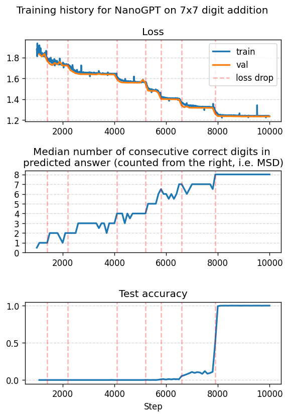

# Plots

## Experiment 1: UT trained on 1 and 3 digits

### Trained with 1 recurrent step

### Trained with 3 recurrent steps

## Experiment 2: UT trained on 1-7 digits

### Trained with 1 recurrent step

### Trained with 3 recurrent steps

## Experiment 6: NanoGPT on 7x7 digit addition

